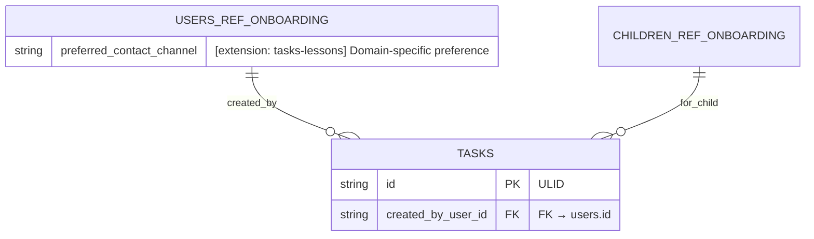

# Mermaid ERD Guidelines

These conventions ensure diagrams render reliably and stay informative.

## Syntax Conventions

- Use `erDiagram` blocks.
- Annotate columns with: `PK`, `FK`, `UK` where applicable.
- Use double quotes around descriptions and single quotes inside examples.
  - Example: `string settings_json "Account prefs JSON. Example: {'locale':'en-GB'}"`
- Avoid Mermaid comments (%%) inside entity blocks to prevent rendering issues.
- Keep field descriptions concise; prefer one line per field.

## Relationship Notation

- `||--||` for 1:1, `||--o{` for 1:N (left side one, right side many).
- Label relationships with short verbs or nouns.

## Composite Constraints

- Mermaid ERD does not support composite unique keys inline; document them in the PRD and in field descriptions.
  - Example note: `int version "Monotonic version per profile (unique per profile)"`

## Domain Split

- Split large ERDs by domain for readability: onboarding, tasks/lessons, progress.
- Duplicate shared entities minimally to keep each diagram self-contained.

## Cross-Domain References

- Prefer canonical definitions in a single ERD and reference them elsewhere.
  - Canonical: USERS, CHILDREN, ASSETS live in onboarding ERD for this repo.
- Reference naming: use UPPER*SNAKE_CASE with `\_REF*<SOURCE>` suffix.
  - Examples: `USERS_REF_ONBOARDING`, `CHILDREN_REF_ONBOARDING`, `ASSETS_REF_ONBOARDING`.
- Default usage: references appear only in relationships; do not duplicate canonical fields.
  - Inside entity blocks, FK descriptions should point to canonical tables (for clarity): `FK → users.id`, not the ref name.
- Do not mix canonical and `_REF_` versions of the same entity in one diagram.
- If Mermaid layout requires a node declaration, you may add an empty stub block for the ref (no fields), but prefer relationship-only usage.

### Domain Extensions on References

- When a domain needs to add properties, do NOT modify the canonical entity in its own ERD.
- Instead, add extension properties to the reference node in the domain ERD.
  - Only list the new properties; never repeat canonical fields.
  - Mark descriptions clearly as extensions, e.g., `"[extension: tasks-lessons] Short explanation"`.
  - This makes it explicit which domain adds extensions and avoids drift in the canonical definition.
- Storage note: extensions should map to domain-owned tables/joins in the actual schema; the reference block is documentation of the logical extension, not a directive to mutate the canonical table.

Sample pattern:

## Field Types & Timestamps

- Prefer `TEXT` (string) identifiers using ULIDs for portability.
- Use epoch milliseconds for `created_at`/`updated_at` and name them consistently across tables.
